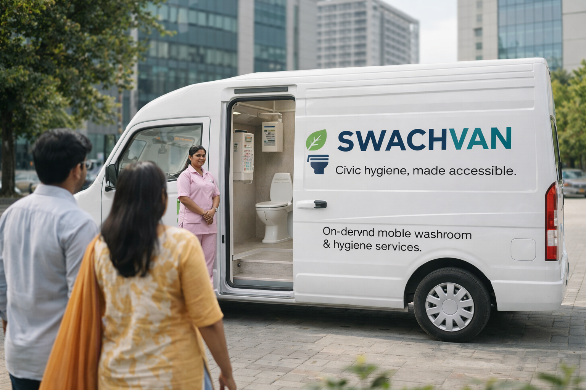

<div align="center">



# 🚐 SwachhVan

### *Smart Mobile Washroom Service for Urban India*

**Hack For Green Bharat 🇮🇳 — Pathway Hackathon Submission**

[](https://hack-for-green-bharat-swachhvan.vercel.app/)

[](https://react.dev)
[](https://typescriptlang.org)
[](https://vitejs.dev)
[](https://supabase.com)
[](https://pathway.com)
[](https://leafletjs.com)

---

*SwachhVan connects citizens with GPS-tracked mobile washroom vans equipped with real-time sensor monitoring, AI-powered chatbot support, and sustainable hygiene solutions — empowering cleaner, greener cities.*

🔗 **[Live Demo → hack-for-green-bharat-swachhvan.vercel.app](https://hack-for-green-bharat-swachhvan.vercel.app/)**

</div>

---

## 📋 Table of Contents

- [Problem Statement](#-problem-statement)
- [Our Solution](#-our-solution)
- [Key Features](#-key-features)
- [AI Chatbot — SwachhVan AI](#-ai-chatbot--swachhvan-ai)
- [Location Search — SerpAPI Integration](#-location-search--serpapi-integration)
- [Tech Stack](#-tech-stack)
- [Architecture](#-architecture)
- [Getting Started](#-getting-started)
- [Backend Setup](#-backend-setup)
- [Project Structure](#-project-structure)
- [Demo Credentials](#-demo-credentials)
- [Screenshots](#-screenshots)
- [Team](#-team)

---

## 🎯 Problem Statement

India faces a severe shortage of accessible, clean public washrooms — particularly in urban areas, event venues, and construction sites. Women and marginalized communities are disproportionately affected, leading to health risks, open defecation, and dignity concerns.

## 💡 Our Solution

**SwachhVan** is a mobile-first platform that deploys GPS-tracked washroom vans across cities. Users can:

- **Locate** the nearest available van in real time on a live map
- **Book** washroom services (toilets, showers, sanitary pad dispensers)
- **Pay** digitally via UPI/QR codes
- **Rate** cleanliness and report issues instantly
- **Chat** with an AI assistant powered by Pathway RAG for instant support

---

## ✨ Key Features

| Feature | Description |
|---------|-------------|
| 🗺️ **Live Van Tracking** | Real-time GPS tracking of all vans on an interactive Leaflet map |
| 🤖 **AI Chatbot (51 FAQs)** | Intelligent keyword-scored RAG chatbot with 51 FAQs across 12+ categories |
| 🔐 **OTP Authentication** | Secure email OTP login via Supabase Auth |
| 📍 **Worldwide Location Search** | Search any city/place globally via SerpAPI Google Maps geocoding |
| 💳 **Digital Payments** | UPI & QR-based cashless payment integration |
| ⭐ **Ratings & Feedback** | Star ratings and cleanliness feedback system |
| 🚿 **Service Categories** | Toilets, showers, sanitary pads, eco-friendly products |
| 👩 **Women's Facilities** | Dedicated safe spaces with feminine hygiene amenities |
| 🌱 **Sustainability Focus** | Eco-friendly products, water recycling, solar-powered vans |
| 📊 **Admin Dashboard** | Real-time fleet monitoring with sensor data (water, waste, battery) |
| 👤 **User Profiles** | Service history, saved locations, referral program |
| 🎁 **Refer & Earn** | Incentive-based referral system for user growth |
| 🌐 **Fallback Geocoding** | Offline fallback for 17+ Indian cities when backend is unreachable |

---

## 🤖 AI Chatbot — SwachhVan AI

The SwachhVan AI chatbot is a comprehensive support assistant trained with **51 FAQs** across **12+ categories**:

| Category | Topics Covered |
|----------|----------------|
| **Hygiene** | Cleaning schedules, sanitization protocols, hygiene standards, water quality |
| **Services** | Washroom booking, freshen up kits, sanitary pads, eco-products, shower access |
| **Booking** | How to book, cancellations, advance booking, group bookings, scheduling |
| **Payment** | UPI/QR payments, pricing, refunds, hidden charges |
| **Safety** | Women's safety, CCTV monitoring, emergency protocols, SOS features |
| **Sustainability** | Water recycling, solar power, biodegradable products, waste management |
| **Technology** | IoT sensors, GPS tracking, real-time monitoring, smart alerts |
| **Operations** | Operating hours, service areas, fleet management |
| **Feedback** | Ratings, complaint resolution, service improvement |
| **Referral** | Refer & Earn program, reward redemption |
| **Account** | Profile settings, notification preferences, account management |
| **Support** | Contact methods, emergency assistance |

### Scoring Algorithm

The RAG server uses a multi-signal keyword scoring system:
- **Exact word-to-keyword match** — weight ×6
- **Keyword hit** — weight ×4
- **Partial match** — weight ×2
- **Question word overlap** — weight ×2
- **Exact substring match** — weight ×12
- **Category match** — weight ×3

### Quick Suggestions

The chatbot offers 8 quick-reply suggestions: booking, pricing, safety, payments, availability, cleanliness, referrals, and waste management.

---

## 📍 Location Search — SerpAPI Integration

SwachhVan supports **worldwide location search** powered by SerpAPI's Google Maps engine:

- Users tap the **pencil icon** on the home page to search any place globally
- The backend `/v1/geocode` endpoint converts place names → lat/lng coordinates
- The `/v1/nearby` endpoint finds nearby places around any given coordinates
- The map re-centers to the searched location and recalculates nearest van ETA
- **Fallback geocoding** for 17 Indian cities works even when the backend is offline

### Supported Cities (Offline Fallback)

Delhi, Mumbai, Bangalore, Chennai, Kolkata, Hyderabad, Pune, Ahmedabad, Jaipur, Lucknow, Chandigarh, Bhopal, Noida, Gurgaon/Gurugram, and more.

---

## 🛠️ Tech Stack

### Frontend
| Technology | Purpose |
|-----------|---------|
| **React 18** | UI framework with component-based architecture |
| **TypeScript** | Type-safe development |
| **Vite 7** | Lightning-fast build tooling & HMR |
| **Tailwind CSS** | Utility-first responsive styling |
| **shadcn/ui** | Accessible, customizable UI components |
| **Leaflet** | Interactive maps with OpenStreetMap (free, no API key) |
| **React Query** | Server state management & caching |
| **React Router v6** | Client-side routing with protected routes |

### Backend
| Technology | Purpose |
|-----------|---------|
| **Supabase** | PostgreSQL database, real-time subscriptions, auth |
| **Pathway** | Real-time RAG pipeline for AI chatbot |
| **Python** | Van simulator & RAG server (HTTP, port 8091) |
| **SerpAPI** | Google Maps geocoding for worldwide location search |

### Key Integrations
| Integration | Purpose |
|------------|--------|
| **Supabase Auth** | Email OTP authentication |
| **Supabase Realtime** | Live van position updates via WebSocket |
| **Pathway RAG** | Retrieval-Augmented Generation for intelligent chatbot (51 FAQs) |
| **OpenStreetMap** | Free, open-source map tiles |
| **SerpAPI Google Maps** | Geocoding & nearby search for any location worldwide |

---

## 🏗️ Architecture

```
┌──────────────────────────────────────────────────────────────┐
│                     SwachhVan Frontend                       │
│               React + TypeScript + Vite                      │
│                                                              │
│  ┌──────────┐ ┌──────────┐ ┌──────────┐ ┌──────────────────┐ │
│  │ Live Map │ │ Services │ │ Payments │ │    ChatBot       │ │
│  │ (Leaflet)│ │  Booking │ │  UPI/QR  │ │ (51 FAQs + RAG)  │ │
│  └────┬─────┘ └────┬─────┘ └────┬─────┘ └───────┬──────────┘ │
│       │             │            │               │            │
│  ┌────▼─────────────┐                                        │
│  │ Location Search  │  geocodePlace() → /v1/geocode          │
│  │ (SerpAPI Google) │  searchNearby() → /v1/nearby           │
│  └────┬─────────────┘                                        │
└───────┼─────────────┼────────────┼───────────────┼────────────┘
        │             │            │               │
   ┌────▼─────────────▼────────────▼───┐    ┌──────▼─────────┐
   │         Supabase Backend          │    │   RAG Server   │
   │  ┌──────────┐  ┌──────────────┐   │    │  (Port 8091)   │
   │  │ Postgres │  │   Realtime   │   │    ├────────────────┤
   │  │   Auth   │  │  WebSocket   │   │    │ /v1/ask (FAQ)  │
   │  └──────────┘  └──────────────┘   │    │ /v1/geocode    │
   └───────────────────┬───────────────┘    │ /v1/nearby     │
                       │                    └──────┬─────────┘
                 ┌─────▼──────┐              ┌─────▼──────┐
                 │    Van     │              │  SerpAPI   │
                 │ Simulator  │              │ Google Maps│
                 │  (8 vans)  │              └────────────┘
                 └────────────┘
```

---

## 🚀 Getting Started

### Prerequisites

- **Node.js** ≥ 18.x & **npm** ≥ 9.x
- **Python** ≥ 3.9 (for backend services)
- **Git**

### 1. Clone the Repository

```bash
git clone https://github.com/your-username/swachhvan.git
cd swachhvan
```

### 2. Configure Environment

Create a `.env` file in the project root:

```env
# ── Frontend (Vite) ──
VITE_SUPABASE_URL=https://your-project.supabase.co
VITE_SUPABASE_ANON_KEY=your-anon-key
VITE_RAG_URL=http://localhost:8091
VITE_GEOCODE_URL=http://localhost:8091
VITE_DEMO_AUTH=true

# ── Backend (Python) ──
SUPABASE_URL=https://your-project.supabase.co
SUPABASE_SERVICE_KEY=your-service-role-key

# ── SerpAPI (Location Search) ──
SERPAPI_KEY=your-serpapi-key
```

> **Note:** Get a free SerpAPI key from [serpapi.com](https://serpapi.com) for worldwide location search. Without it, the app falls back to 17 pre-configured Indian cities.

### 3. Install & Run Frontend

```bash
npm install
npm run dev
```

The app will be available at `http://localhost:5173`

### 4. Build for Production

```bash
npm run build
npm run preview
```

---

## 🐍 Backend Setup

### Install Python Dependencies

```bash
cd backend
pip install -r requirements.txt
```

### Start the RAG Server (Pathway)

```bash
python rag_server.py
# → Pathway RAG chatbot running on http://localhost:8091
# → 51 FAQs loaded across 12+ categories
# → Endpoints: /v1/ask, /v1/geocode, /v1/nearby, /health
# → SerpAPI geocoding enabled (if SERPAPI_KEY is set)
```

### Start the Van Simulator

```bash
python van_simulator.py
# → Simulates 8 vans (SV-01 to SV-08) moving around Delhi NCR
# → GPS + sensor data (water, waste, battery levels)
```

The simulator writes telemetry data to Supabase in real time, which the frontend picks up via Supabase Realtime subscriptions.

### API Endpoints (Port 8091)

| Endpoint | Method | Description |
|----------|--------|-------------|
| `/v1/ask` | POST | AI chatbot — send `{"query": "..."}`, get FAQ answer |
| `/v1/geocode` | POST | Geocode a place name — send `{"query": "Mumbai"}`, get lat/lng |
| `/v1/nearby` | POST | Find nearby places — send `{"lat": ..., "lng": ..., "query": "..."}` |
| `/health` | GET | Server health check |

---

## 📁 Project Structure

```
swachhvan/
├── public/                  # Static assets (SVGs, favicon)
├── src/
│   ├── components/
│   │   ├── ChatBot.tsx      # AI chatbot (Pathway RAG integration)
│   │   ├── RequireAuth.tsx   # Route protection wrapper
│   │   ├── layout/          # PhoneShell responsive layout
│   │   ├── map/             # LiveMap with Leaflet
│   │   ├── menu/            # App navigation menu
│   │   └── ui/              # shadcn/ui components
│   ├── contexts/
│   │   └── AuthContext.tsx   # Supabase auth with OTP
│   ├── hooks/
│   │   └── useRealtimeVans.ts # Real-time van tracking hook
│   ├── lib/
│   │   ├── authService.ts    # Auth helper functions
│   │   ├── supabaseClient.ts # Supabase client config
│   │   ├── vanService.ts     # Van CRUD + RAG chatbot + geocode + weather
│   │   └── utils.ts          # Utility functions
│   ├── pages/                # All app pages (20+ screens)
│   ├── App.tsx               # Root component with routing
│   └── main.tsx              # Entry point
├── backend/
│   ├── rag_server.py         # RAG server (51 FAQs + geocode + nearby endpoints)
│   ├── van_simulator.py      # Van GPS & sensor simulator (8 vans, Delhi NCR)
│   ├── pathway_pipeline.py   # Pathway data processing pipeline
│   └── requirements.txt      # Python dependencies
├── .env                      # Single environment config
├── package.json
├── tailwind.config.ts
├── vite.config.ts
└── tsconfig.json
```

---

## 🔑 Demo Credentials

For testing without Supabase configuration:

| Field | Value |
|-------|-------|
| **Demo Auth** | Enabled via `VITE_DEMO_AUTH=true` |
| **Login** | Enter any email → OTP verification is auto-handled in demo mode |

---

## 📸 Screenshots

<div align="center">

| Landing Page | Live Map | Service Booking |
|:---:|:---:|:---:|
| *Mobile-first landing* | *Real-time van tracking* | *Book washroom services* |

| AI Chatbot | Payments | Dashboard |
|:---:|:---:|:---:|
| *Pathway RAG assistant* | *UPI/QR payments* | *Fleet monitoring* |

</div>

---

## 🌍 Sustainability Impact

SwachhVan aligns with **UN Sustainable Development Goals**:

- **SDG 6** — Clean Water & Sanitation
- **SDG 3** — Good Health & Well-being
- **SDG 5** — Gender Equality (dedicated women's facilities)
- **SDG 11** — Sustainable Cities & Communities
- **SDG 12** — Responsible Consumption (eco-friendly products)

---

## � Changelog

### Recent Updates

| Change | Details |
|--------|---------|
| **AI Chatbot Expansion** | Expanded from 12 → 51 FAQs across 12+ categories with improved multi-signal keyword scoring |
| **SerpAPI Google Maps** | Integrated worldwide location search — users can search any city/place on Earth |
| **Location Search UI** | Home page pencil button opens a search bar to find vans near any location |
| **Geocode Fallback** | Offline fallback geocoding for 17 Indian cities when backend is unreachable |
| **Map Stacking Fix** | Fixed Leaflet map z-index bleeding through the side menu overlay |
| **OTP UI Cleanup** | Removed demo OTP code display and auto-fill button from the verification screen |
| **Chatbot Suggestions** | Updated quick-reply suggestions from 5 → 8 covering all major user queries |
| **Frontend Fallback FAQs** | Expanded client-side fallback from 6 → 19 FAQ entries for offline chatbot support |

---

## �👥 Team

Built with ❤️ for **Hack For Green Bharat** hackathon.

---

<div align="center">

*Making India cleaner, one van at a time.* 🇮🇳

</div>
